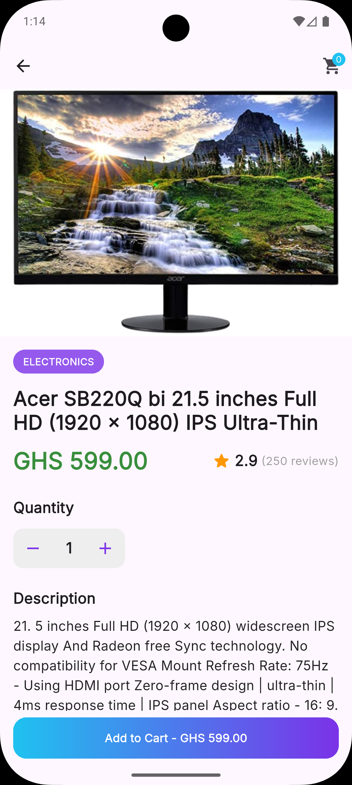

# Teczaleel

Advanced flutter practical assessment - junior developer.


## Architecture
The project is built using a **Clean Architecture** approach with three distinct layers:
- **Presentation**: UI widgets and Riverpod Providers (Notifiers) for state management.
- **Domain**: Pure business logic, including Entities and Use Cases.
- **Data**: Repository implementations and Data Sources (REST API and Hive Local Storage).

## State Management
I used **Riverpod** for state management, specifically leveraging `AsyncNotifier` and `Notifier`.
- **Choice**: chosen for its compile-time safety, ease of testing, and lack of dependency on the BuildContext.
- **Trade-offs**: Compared with other state managers like GetX, it introduces more boilerplate but it offers significantly better long-term scalability.

## Caching Strategy
To provide a seamless user experience, the application implements a multi-layered caching system using **Hive** as the persistence engine.

- **Immediate Hydration**: On screen entry, the app immediately loads and displays data from the local persistence layer. This eliminates loading spinners for returning users.
- **Background Sync**: Simultaneously, a network request is dispatched in the background. Once the fresh data arrives, the UI updates reactively, and the local cache is refreshed.
- **Offline Fallback**: In the absence of an internet connection, the app remains fully functional by serving the last cached data from storage.

- **Expiration Reasoning**: 
    - **Products**: 4-hour (stale data is acceptable for catalog items).
    - **Categories**: 12-hour (categories are highly static).

This balance reduces redundant network calls while ensuring the catalog remains reasonably up-to-date.

## Error Handling
The system maps low-level exceptions to domain-level failures:
1. **Data Layer**: Catches specific exceptions (e.g., `ServerException`, `CacheException`) from Dio or Hive.
2. **Repository Layer**: Maps these exceptions to `Failure` types (`ServerFailure`, `CacheFailure`, `NetworkFailure`).
3. **Domain/Presentation Layer**: Leverages the `dartz` `Either` type to handle success or failure explicitly, allowing the UI to render appropriate error states or retry buttons.

## Known Limitations
- **FakeStoreAPI**: Due to the lack of pagination from Fakestore API, the pagination is currently simulated locally.
- **Simple Search**: Search logic is implemented locally on the current list rather than server-side.

## Future Improvements
- **UI/UX**: Implement a more modern UI/UX experience with a more robust shimmer effect for loading states and interactive animations.
- **Theming**: Improve app branding theme and also implement dark/ light modes
- **Localization**: Support multi-language strings for global accessibility.

## Screenshots




## How to Run
1. Ensure Flutter is installed and running correctly.
2. Clone the repository and run `flutter pub get`.
3. Launch an emulator or connect a physical device.
4. Run the app:
   ```bash
   flutter run
   ```
5. Run tests:
   ```bash
   flutter test
   ```
